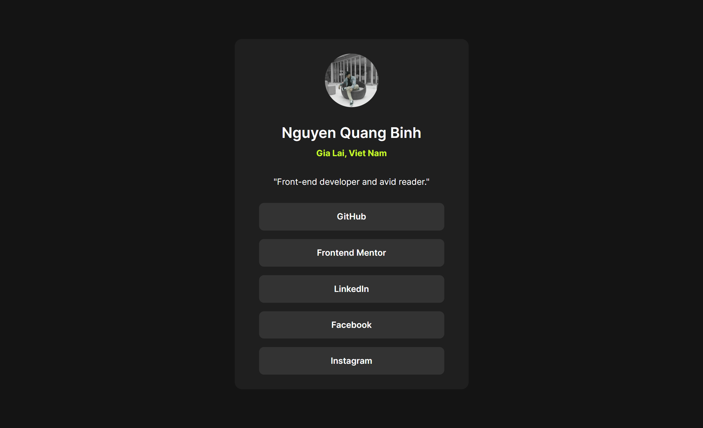

# Frontend Mentor - Social links profile solution

This is a solution to the [Social links profile challenge on Frontend Mentor](https://www.frontendmentor.io/challenges/social-links-profile-UG32l9m6dQ). Frontend Mentor challenges help you improve your coding skills by building realistic projects. 

## Table of contents

- [Overview](#overview)
  - [The challenge](#the-challenge)
  - [Screenshot](#screenshot)
  - [Links](#links)
- [My process](#my-process)
  - [Built with](#built-with)
  - [What I learned](#what-i-learned)
  - [Continued development](#continued-development)
  - [Useful resources](#useful-resources)
  - [AI Collaboration](#ai-collaboration)
- [Author](#author)
- [Acknowledgments](#acknowledgments)

**Note: Delete this note and update the table of contents based on what sections you keep.**

## Overview

### The challenge

Users should be able to:

- See hover and focus states for all interactive elements on the page

### Screenshot

### Links

- Solution URL: [Solution here](https://github.com/nqbinh98/social-links-profile)
- Live Site URL: [Live site URL here](https://nqbinh98.github.io/social-links-profile/)

## My process

### Built with

- Semantic HTML5 markup - Using <ul> and <li> for the social links list.
- CSS Custom Properties (Variables) - For efficient color and theme management.
- Flexbox - Used for centering the card component and layout alignment.
- Mobile-first workflow - Ensuring the design is responsive across all screen sizes.
- Local Font Hosting - Using @font-face for the Inter font family.

### What I learned

In this project, I strengthened my understanding of writing clean, maintainable CSS. One of the key takeaways was using CSS Variables to manage the color palette, making it easy to update themes globally.

I also learned how to improve the user experience by making the entire button area clickable. By setting the <a> tag to display: block and moving the padding from the list item to the anchor tag, I ensured a larger, more accessible hit target for users.

CSS
/* Improving UX by expanding the clickable area */
.link-item a {
    display: block;
    width: 100%;
    padding: 10px 24px;
    text-decoration: none;
    /* This makes the whole button clickable, not just the text */
}

/* Using pseudo-classes to handle spacing */
.link-item:last-child a {
    margin-bottom: 0;
}

### Continued development

For future projects, I want to explore:

- CSS Grid: While Flexbox worked great here, I want to try Grid for more complex card layouts.
- Transitions & Animations: I plan to add smooth hover effects using transition to make the UI feel more interactive.
- Advanced Accessibility: Learning more about ARIA labels to ensure my components are even more friendly for screen readers.

### AI Collaboration

During this project, I collaborated with Gemini (AI) to:

- Audit my HTML for semantic correctness and accessibility.
- Optimize the CSS structure, specifically moving from hardcoded hex colors to CSS Variables.
- Discuss the best practices for Media Queries and responsive padding to ensure the "Pixel Perfect" look on both 375px and 1440px screens.

## Author

- Github - [nqbinh98](https://github.com/nqbinh98/)
- Frontend Mentor - [@nqbinh98](https://www.frontendmentor.io/profile/nqbinh98)

## Acknowledgments

I’d like to thank the Frontend Mentor community and the AI assistant for providing clear feedback on my code structure, which helped me transition from using plain 
 tags to a more semantic <ul> and <li> approach.